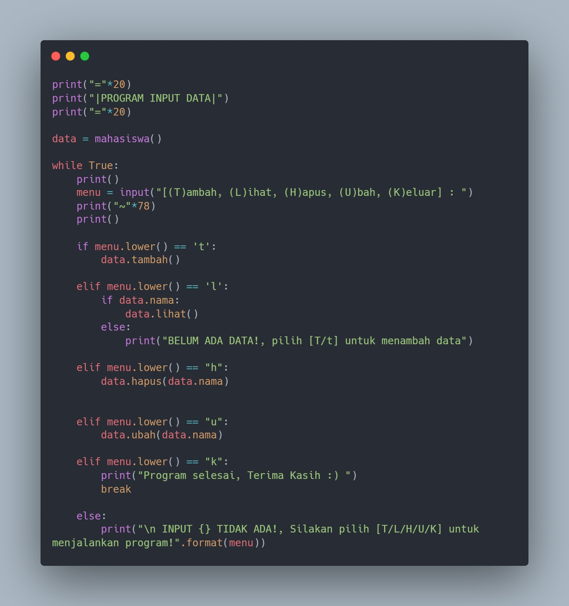

# Pertemuan-12
# OOP

## Profil
| Variable | Isi |
| -------- | --- |
| **Nama** | Faiz Maulana |
| **NIM** | 312310469 |
| **Kelas** | TI.23.A5 |
| **Mata Kuliah** | Bahasa Pemrograman |

### Tugas Praktikum
_Buat program sederhana dengan mengaplikasikan penggunaan class. Buatlah 
class untuk menampilkan daftar nilai mahasiswa, dengan ketentuan:_
- _Method tambah() untuk menambah data_
- _Method tampilkan() untuk menampilkan data_
- _Method hapus(nama) untuk menghapus data berdasarkan nama_
- _Method ubah(nama) untuk mengubah data berdasarkan nama_
- _Buat diagram class, flowchart dan penjelasan programnya pada README.md._
- _Commit dan push repository ke github._

- _Membuat `class mahasiswa():` dengan instance class_ 

- _Menambahkan method / fungsi, pada data inputan `Nama`, `NIM`, `UTS`, `UAS`, `Tugas`._

- _Menampilkan method / fungsi. `f` = Format_

- _Menghapus data yg sudah di input. `del self.nama[index]` = menghapus nama_
- _`[index]` Berfungsi agar inputan menjadi onject_

- _Mengubah data yg sudah di input_
- _`index = self.nama.index(nama)` Membuat variable index dengan `self.nama` di dalam nya_

- _Perulangan dengan memilih [T/L/H/U/K] untuk menjalankan program apa yg ingin di gunakan._

### Hasil Program 

#### Tambah data & Lihat data  

#### Ubah & hapus data

#### Keluar

### Flowchart

